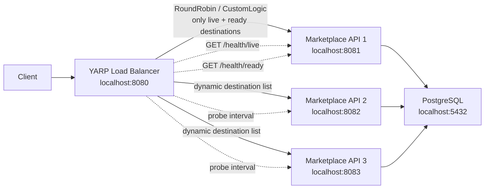

# Marketplace Sample Load Balancer

Dynamic L7 load balancing sample for ASP.NET Core Web API instances using YARP, Docker Compose, PostgreSQL, OpenIddict, and health-driven destination management.

The project demonstrates how to run the same marketplace API behind a configurable reverse proxy, keep destination state in memory, probe liveness/readiness endpoints, and reload the proxy destination list without restarting the gateway.

## Features

- **Dynamic YARP gateway** - routes `/marketplace/**` traffic to healthy Marketplace API instances.
- **Health-driven destination updates** - liveness removes dead instances; readiness controls whether an instance is eligible for traffic.
- **Runtime state inspection** - exposes current destination state, active destinations, probe counters, and last probe errors.
- **Reload support** - proxy configuration is rebuilt and reloaded through YARP's in-memory config provider.
- **Configurable load balancing** - hosts, route path, probe paths, probe intervals, thresholds, and algorithm are controlled by configuration.
- **Three API instances** - Docker Compose starts `api1`, `api2`, and `api3` behind the gateway.
- **Token-protected API** - product endpoints are protected with OpenIddict bearer tokens.
- **Clean layered sample** - API, Application, Domain, and Infrastructure projects are separated.

## Tech Stack

| Area | Technology |
| --- | --- |
| Runtime | .NET 8 |
| Web API | ASP.NET Core Controllers |
| Reverse proxy | YARP Reverse Proxy 2.3 |
| Authentication | ASP.NET Core Identity + OpenIddict 7.5 |
| Persistence | PostgreSQL 16 + EF Core 8 |
| CQRS/Mediator | MediatR |
| Validation | FluentValidation |
| API docs | Swagger / Swashbuckle |
| Containers | Docker + Docker Compose |

## Solution Structure

```text
MarketplaceSample/
+-- gateway/
|   +-- Yarp.LoadBalancer/          # Dynamic YARP gateway
+-- src/
|   +-- MarketplaceSample.Api/      # Marketplace HTTP API, auth, health endpoints
|   +-- MarketplaceSample.Application/
|   +-- MarketplaceSample.Domain/
|   +-- MarketplaceSample.Infrastructure/
+-- docker-compose.yml
+-- docker-compose.override.yml
```

## Architecture



## Load Balancer Behavior

The gateway keeps an in-memory state for each configured destination:

- `IsLive`
- `IsReady`
- `ConsecutiveLiveFailures`
- `ConsecutiveReadySuccesses`
- `ConsecutiveReadyFailures`
- `LastCheckedAt`
- `LastError`

Routing uses only destinations where:

```text
IsLive == true && IsReady == true
```

When probe results change a destination's routable state, the gateway rebuilds the YARP route/cluster configuration and reloads it through the dynamic config provider. This avoids process restarts when backends become ready, unready, dead, or alive again.

## Configuration

Gateway configuration lives in:

[MarketplaceSample/gateway/Yarp.LoadBalancer/appsettings.Development.json](MarketplaceSample/gateway/Yarp.LoadBalancer/appsettings.Development.json)

```json
{
  "LoadBalancer": {
    "RoutePath": "/marketplace/{**catch-all}",
    "PathPattern": "{**catch-all}",
    "LoadBalancingPolicy": "RoundRobin",
    "LivenessPath": "/health/live",
    "ReadinessPath": "/health/ready",
    "ProbeIntervalSeconds": 5,
    "ProbeTimeoutSeconds": 2,
    "HealthyThreshold": 1,
    "UnhealthyThreshold": 2,
    "Destinations": [
      {
        "Id": "destination1",
        "Address": "http://marketplacesample.api1:8080/"
      }
    ]
  }
}
```

### Important Options

| Option | Purpose |
| --- | --- |
| `RoutePath` | Public gateway route pattern. |
| `PathPattern` | Path forwarded to backend APIs. |
| `LoadBalancingPolicy` | YARP policy, for example `RoundRobin`, `PowerOfTwoChoices`, or custom `CustomLogic`. |
| `LivenessPath` | Endpoint used to decide whether a destination should stay alive. |
| `ReadinessPath` | Endpoint used to decide whether a destination can receive traffic. |
| `ProbeIntervalSeconds` | Delay between probe cycles. |
| `ProbeTimeoutSeconds` | HTTP timeout per probe request. |
| `HealthyThreshold` | Consecutive ready successes required before adding a destination. |
| `UnhealthyThreshold` | Consecutive failures required before removing a destination. |
| `Destinations` | Backend instances known by the gateway. |

In Docker Compose, the gateway mounts `appsettings.Development.json` into the container. Editing the file on the host lets the monitor reload the active proxy configuration without restarting the gateway.

## API Endpoints

### Gateway

| Method | Endpoint | Description |
| --- | --- | --- |
| `GET` | `/marketplace/api/v1/products` | Routes to an active Marketplace API instance. Requires bearer token. |
| `POST` | `/marketplace/api/v1/products` | Creates a product through an active Marketplace API instance. Requires bearer token. |
| `GET` | `/load-balancer/state` | Shows configured options, destination health state, and active destinations. |
| `POST` | `/load-balancer/reload` | Manually triggers YARP config reload. |
| `GET` | `/health` | Gateway health check. |

### Marketplace API

| Method | Endpoint | Description |
| --- | --- | --- |
| `POST` | `/api/v1/users/register` | Registers a first-party Identity user. |
| `POST` | `/security/oauth/token` | Issues OpenIddict access/refresh tokens using password grant. |
| `GET` | `/api/v1/users/me` | Returns the current authenticated user. |
| `GET` | `/api/v1/products` | Lists products. Requires bearer token. |
| `POST` | `/api/v1/products` | Creates a product. Requires bearer token. |
| `GET` | `/health` | General health check. |
| `GET` | `/health/live` | Liveness probe. |
| `GET` | `/health/ready` | Readiness probe. |

## Quick Start

### Prerequisites

- .NET 8 SDK
- Docker Desktop

### Run With Docker Compose

```powershell
cd D:\sisharpchi\dotnet-samples-with-loadbalancer\MarketplaceSample
docker compose up --build
```

Services:

| Service | URL |
| --- | --- |
| YARP gateway | `http://localhost:8080` |
| Marketplace API 1 | `http://localhost:8081` |
| Marketplace API 2 | `http://localhost:8082` |
| Marketplace API 3 | `http://localhost:8083` |
| PostgreSQL | `localhost:5432` |

### Inspect Load Balancer State

```powershell
curl http://localhost:8080/load-balancer/state
```

### Reset Database Volume

```powershell
docker compose down -v
```

## Testing Readiness And Liveness

Each API instance can be controlled through environment variables in `docker-compose.override.yml`:

```yaml
Health__Live: "true"
Health__Ready: "true"
```

Examples:

| Scenario | Change | Expected Result |
| --- | --- | --- |
| Remove instance from traffic but keep it alive | `Health__Ready=false` | Gateway removes it from active destinations. |
| Mark instance as dead | `Health__Live=false` | Gateway removes it after the unhealthy threshold. |
| Add instance back | Set both values to `true` | Gateway adds it after the healthy threshold. |
| Add a new backend host | Add a destination in `LoadBalancer:Destinations` | Gateway reloads the destination list. |
| Change algorithm | Change `LoadBalancingPolicy` | Gateway reloads cluster config. |

## Authentication Flow

1. Register a user:

```http
POST /api/v1/users/register
Content-Type: application/json

{
  "userName": "admin",
  "email": "admin@example.com",
  "firstName": "Admin",
  "lastName": "User",
  "password": "1234"
}
```

2. Request a token:

```http
POST /security/oauth/token
Content-Type: application/x-www-form-urlencoded

grant_type=password&username=admin&password=1234
```

3. Call protected product endpoints with:

```http
Authorization: Bearer <access_token>
```

## Development Notes

- EF Core migrations run automatically at API startup through `Database.MigrateAsync()`.
- Product endpoints are intentionally protected to demonstrate gateway + auth interaction.
- The dynamic load balancer stores state in memory. Restarting the gateway resets counters and destination status.
- This is a sample project, so development certificates and local Docker credentials are not production hardening.

## Useful Commands

```powershell
# Build gateway
dotnet build MarketplaceSample\gateway\Yarp.LoadBalancer\Yarp.LoadBalancer.csproj

# Build API
dotnet build MarketplaceSample\src\MarketplaceSample.Api\MarketplaceSample.Api.csproj

# Validate Docker Compose
cd MarketplaceSample
docker compose config

# Start all services
docker compose up --build
```

## License

This repository is a sample project. Add a license file before publishing or reusing it as a public template.
